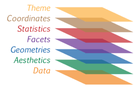

# ggplot 

[ggplot2](https://ggplot2.tidyverse.org/reference/index.html)
[ggplot2](https://github.com/tidyverse/ggplot2/)
[ggplot2 extensions - gallery](https://exts.ggplot2.tidyverse.org/gallery/)

`ggplot2` es un paquete R para producir gráficos estadísticos o de datos. A diferencia de la mayoría de los otros paquetes de gráficos, ggplot2 tiene una gramática subyacente, basada en Grammar of Graphics, que le permite componer gráficos combinando componentes independientes. Esto hace que ggplot2 sea poderoso. En lugar de limitarse a conjuntos de gráficos predefinidos, puede crear gráficos novedosos que se adapten a su problema específico

   

 

